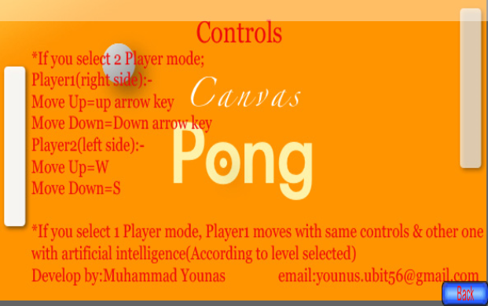
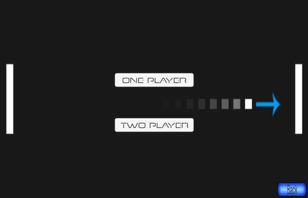
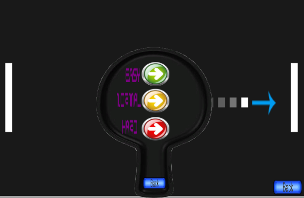
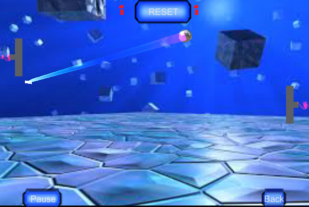

Dont't judge me I've developed this when I am in 1st semester of my B.S :alien: .
<h2> Menu </h2>           

<h2> Instructions </h2>

<h2> Player-mode </h2>

<h2> Level </h2>

<h2> Gameplay </h2>

